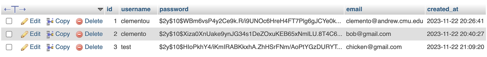
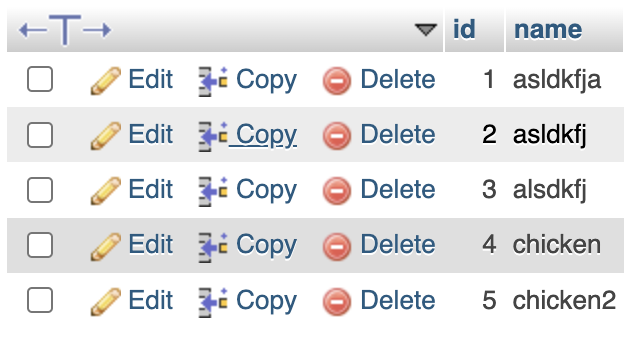
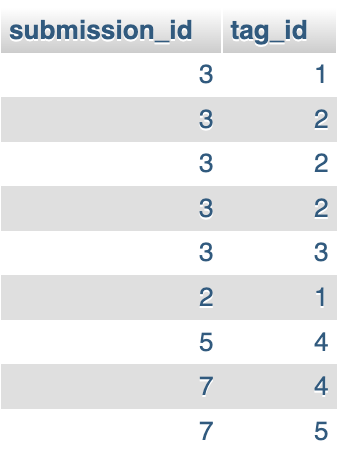
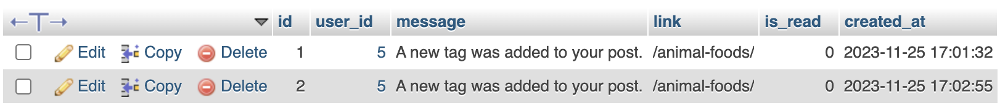
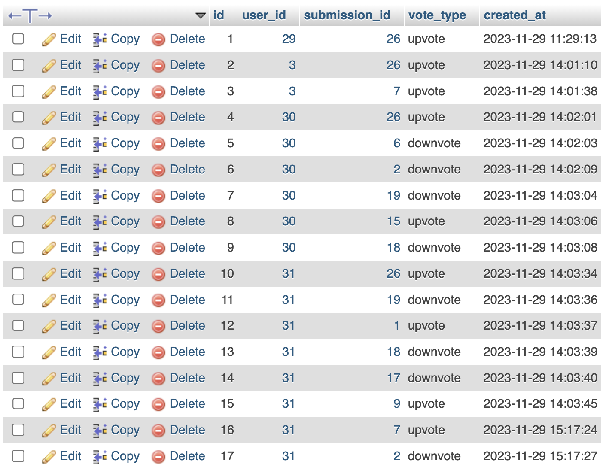
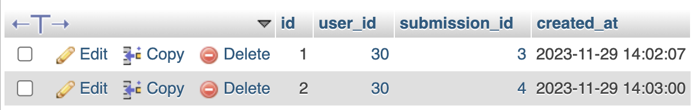
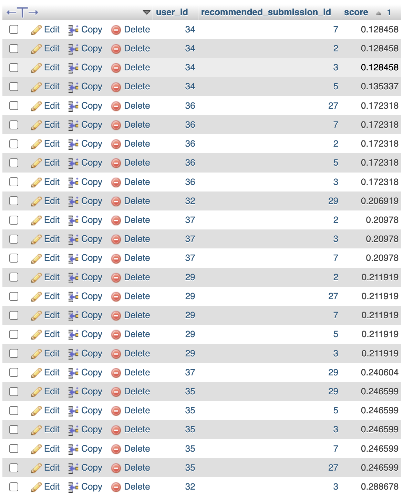

# Animal Foods

Social Web Application for 95-882 Enterprise Web Development.

Uses a Gaussian Mixture Model to calculate recomendations for users based on interactions (likes, favorites) and item content (tags).

Might change it to a hybrid system if I'm feeling frisky.

## users table



```sql
CREATE TABLE users (
    id INT AUTO_INCREMENT PRIMARY KEY,
    username VARCHAR(50) NOT NULL UNIQUE,
    password VARCHAR(255) NOT NULL,
    email VARCHAR(100) NOT NULL UNIQUE,
    created_at TIMESTAMP DEFAULT CURRENT_TIMESTAMP
);
```

## submissions table


```sql
CREATE TABLE submissions (
    id INT AUTO_INCREMENT PRIMARY KEY,
    user_id INT NOT NULL,
    animal VARCHAR(255) NOT NULL,
    food_name VARCHAR(255) NOT NULL,
    description TEXT NOT NULL,
    extra_info TEXT,
    media_link VARCHAR(255),
    created_at TIMESTAMP DEFAULT CURRENT_TIMESTAMP,
    FOREIGN KEY (user_id) REFERENCES users(id)
);
```

## tags table





```sql
CREATE TABLE tags (
    id INT AUTO_INCREMENT PRIMARY KEY,
    name VARCHAR(255) NOT NULL
);

CREATE TABLE submission_tags (
    submission_id INT NOT NULL,
    tag_id INT NOT NULL,
    FOREIGN KEY (submission_id) REFERENCES submissions(id),
    FOREIGN KEY (tag_id) REFERENCES tags(id)
);
```

## badges table


```sql
CREATE TABLE badges (
    id INT PRIMARY KEY AUTO_INCREMENT,
    name VARCHAR(255),
    description TEXT,
    criteria TEXT,
    image_url VARCHAR(255)
);
CREATE TABLE user_badges (
    id INT PRIMARY KEY AUTO_INCREMENT,
    user_id INT,
    badge_id INT,
    awarded_on TIMESTAMP DEFAULT CURRENT_TIMESTAMP,
    FOREIGN KEY (user_id) REFERENCES users(id),
    FOREIGN KEY (badge_id) REFERENCES badges(id)
);
```

## notifications table



```sql
CREATE TABLE notifications (
    id INT PRIMARY KEY AUTO_INCREMENT,
    user_id INT,
    message TEXT,
    link VARCHAR(255),
    is_read BOOLEAN DEFAULT FALSE,
    created_at TIMESTAMP DEFAULT CURRENT_TIMESTAMP,
    FOREIGN KEY (user_id) REFERENCES users(id)
);
```

## votes table



```sql
CREATE TABLE votes (
    id INT AUTO_INCREMENT PRIMARY KEY,
    user_id INT NOT NULL,
    submission_id INT NOT NULL,
    vote_type ENUM('upvote', 'downvote'),
    created_at TIMESTAMP DEFAULT CURRENT_TIMESTAMP,
    FOREIGN KEY (user_id) REFERENCES users(id),
    FOREIGN KEY (submission_id) REFERENCES submissions(id)
);
```

## favorites table



```sql
CREATE TABLE favorites (
    id INT AUTO_INCREMENT PRIMARY KEY,
    user_id INT NOT NULL,
    submission_id INT NOT NULL,
    created_at TIMESTAMP DEFAULT CURRENT_TIMESTAMP,
    FOREIGN KEY (user_id) REFERENCES users(id),
    FOREIGN KEY (submission_id) REFERENCES submissions(id)
);
```

## recommendations table



```sql
CREATE TABLE user_recommendations (
    id INT AUTO_INCREMENT PRIMARY KEY,
    user_id INT NOT NULL,
    recommended_submission_id INT NOT NULL,
    score FLOAT DEFAULT 0,
    FOREIGN KEY (user_id) REFERENCES users(id),
    FOREIGN KEY (recommended_submission_id) REFERENCES submissions(id)
);
```