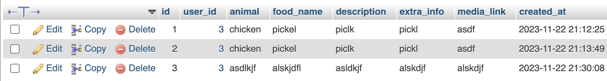

# Animal Foods

## users table


```sql
CREATE TABLE users (
    id INT AUTO_INCREMENT PRIMARY KEY,
    username VARCHAR(50) NOT NULL UNIQUE,
    password VARCHAR(255) NOT NULL,
    email VARCHAR(100) NOT NULL UNIQUE,
    created_at TIMESTAMP DEFAULT CURRENT_TIMESTAMP
);
```

## submissions table



```sql
CREATE TABLE submissions (
    id INT AUTO_INCREMENT PRIMARY KEY,
    user_id INT NOT NULL,
    animal VARCHAR(255) NOT NULL,
    food_name VARCHAR(255) NOT NULL,
    description TEXT NOT NULL,
    extra_info TEXT,
    media_link VARCHAR(255),
    created_at TIMESTAMP DEFAULT CURRENT_TIMESTAMP,
    FOREIGN KEY (user_id) REFERENCES users(id)
);
```